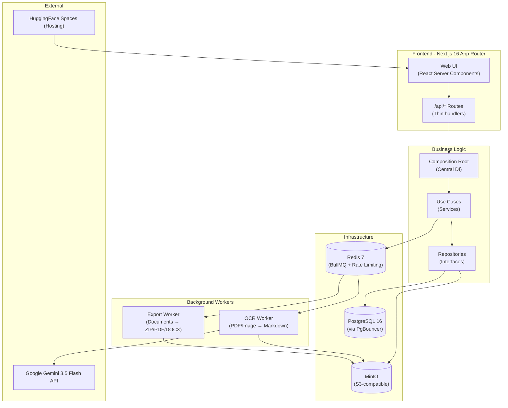
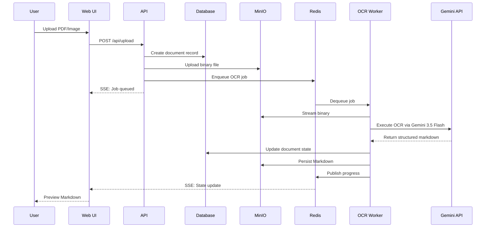

# 📐 الهيكل المعماري والقرارات الهندسية — ARCHITECTURE.md

يوضح هذا الملف البنية الهندسية الكلية لمشروع **Ibn Al-Azhar Docs** والقرارات المعمارية الرئيسية (Design Decisions) التي تحكم عمل التطبيق، لضمان استمرارية التطبيق وفهمه من قِبل أي مطور أو وكيل ذكاء اصطناعي جديد.

---

## 🗺️ 1. مخطط البنية الهندسية الكلية (System Architecture)

---

## 🔄 2. تدفق البيانات لمعالجة الوثائق (Data Flow)

---

## 🧱 2.5. البنية الطبقية للكود — `apps/web/src` (Layered Source Layout)

بعد عملية إعادة الهيكلة الطبقية (layered refactor)، تتبع شفرة `apps/web` تقسيمًا
واضحاً حسب المسؤولية لتقليل الاقتران (low coupling) ورفع التماسك (high cohesion):

| المسار                               | المسؤولية                                                           | الطبقة                |
| ------------------------------------ | ------------------------------------------------------------------- | --------------------- |
| `core/services/`                     | حالات الاستخدام (Use Cases) — منطق الأعمال البحت                    | Domain                |
| `core/repositories/`                 | تطبيقات مستودعات Prisma (DIP)                                       | Infrastructure        |
| `domain/repositories/*.interface.ts` | واجهات المستودعات (تبعيات مقلوبة)                                   | Domain                |
| `core/folder-tree.ts`                | بناء الشجرة + حساب العمق (منطق خالص)                                | Domain                |
| `core/composition-root.ts`           | الربط المركزي (DI) بين المستودعات وحالات الاستخدام                  | Composition Root      |
| `transport/db.ts`                    | نسخة وحيدة من `PrismaClient` (singleton)                            | Transport             |
| `clients/redis/`                     | تحديد المعدل (rate-limit) + القفل الموزع                            | Infrastructure Client |
| `middleware/`                        | المصادقة، حراس الصلاحيات، CSRF، التدقيق، تسجيل الطلبات              | Middleware            |
| `shared/`                            | الأخطاء، المسجّل (logger)، الثوابت، المدقّقات (validators)، OpenAPI | Shared Kernel         |
| `ui/`                                | مكونات React (folders, files, pipeline, layout …)                   | Presentation          |
| `state/`                             | خطافات React (use-folders, use-queries, use-file-upload)            | Presentation State    |
| `api/`                               | عميل واجهة البرمجة (api-client)                                     | Presentation Client   |

**مبادئ أساسية مُطبَّقة:**

- _Dependency Inversion_: حالات الاستخدام تعتمد على **واجهات** المستودعات فقط
  (مثال: `RegistrationUseCases` / `PasswordResetUseCases` تعتمد على
  `IVerificationTokenRepository` بدل `PrismaClient` المجرّد).
- _Single source of truth_: تعريفا `FlatFolder`/`FolderNode` ودالة `buildFolderTree`
  موجودان في مكان واحد هو `core/folder-tree.ts` (وُحدّت النسختان المتباعدتان).
- _No raw Prisma in use cases_: أي وصول لقاعدة البيانات يمر عبر مستودع.

---

## 🧠 3. القرارات المعمارية الرئيسية (Core Architectural Decisions)

تم توثيق القرارات التالية بناءً على كود المشروع الفعلي والمنطق المتبع:

### أ. تحديد معدل الطلبات (Redis-First Rate Limiting)

- **القرار:** يُعتمد على Redis كمصدر وحيد وموثق لتحديد معدل الطلبات الموزعة عبر خوادم متعددة (Distributed Rate Limiting).
- **التفاصيل الاحتياطية:** في حال تعطل Redis أو عدم توفره مؤقتاً، يقوم النظام تلقائياً بالتحول إلى نظام تحديد المعدل المحلي داخل ذاكرة كل خادم (In-memory fallback) لضمان استمرارية عمل التطبيق وتفادي قفل الخدمة تماماً.
- **سياسة الاستثناء:** حماية العمليات التدميرية (مثل الحذف أو التعديل الجماعي) تكون أكثر صرامة من تحديد المعدل المبني على الـ IP، حيث يتم التحقق بناءً على هوية المستخدم الفردية لأن المستخدم الواحد قد يمتلك عدة عناوين IP (مثل العمل من الهاتف والحاسوب في نفس الوقت).

### ب. إدارة طوابير الخلفية (BullMQ Internals)

- **القرار:** يتم تمرير قيمة `null` للمحاولات عند مستوى الأوامر المنفردة، وترك إدارة تكرار المحاولات الفاشلة واستراتيجيات إعادة المحاولة لتقع بالكامل تحت تصرف طوابير BullMQ الداخلية.
- **السبب:** لمنع حدوث تعارض وتكرار العمليات بين خادم الويب وعمال معالجة الخلفية.

### ج. إعداد اتصالات العمال (Worker Connection Lock)

- **القرار:** استخدام قفل اتصال مشترك (`connectionLock`) لمنع حدوث حالات سباق البيانات (Race Conditions) عندما يقوم عمال متعددون باستدعاء دالة `getConnection` في نفس اللحظة للربط بقاعدة البيانات أو Redis.

---

## ⚠️ 4. تنبيهات حول المخاطر والاعتمادية (Critical Risk Warnings)

> [!CAUTION]
> **خطر تركيز المعرفة (Bus Factor = 1.0):**
> تشير إحصاءات Repowise إلى أن المطور **Abed** هو المالك والمسؤول الوحيد بنسبة **100%** عن كامل الكود وتعديلاته في آخر 90 يوماً. لتقليل هذا الخطر:
>
> 1. يجب على أي مطور أو وكيل ذكاء اصطناعي قراءة هذا الملف وملف `.agents/AGENTS.md` قبل البدء.
> 2. يجب توثيق أي ميزة جديدة أو تغيير جوهري في هذا المستند فوراً.
> 3. يوصى بإشراك مطورين آخرين في مراجعة الأكواد البرمجية (Code Review).
