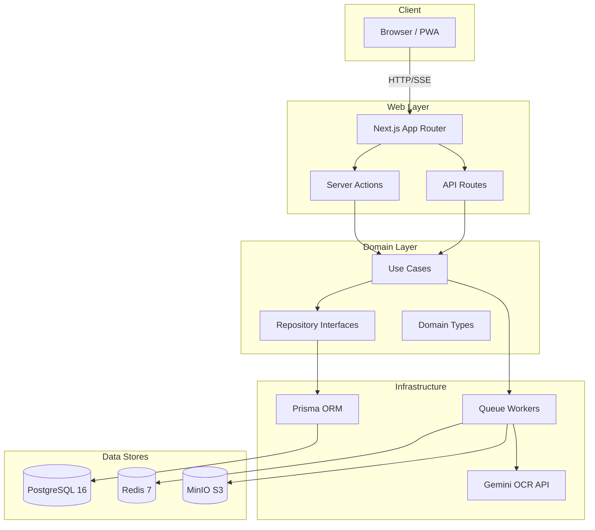

<div align="center">

# Ibn Al-Azhar Docs&nbsp;|&nbsp;مستندات ابن الأزهر

**في بيت كل طالب أزهري**

*An Arabic-first, RTL-first, AI-powered document processing platform built for Azhar students and Arabic literature.*

[](https://github.com/ibn-alazhar-docs/ibn-alazhar-docs/actions/workflows/ci-cd.yml)
[](./LICENSE)
[](https://nodejs.org/)
[](https://pnpm.io/)
[](https://www.typescriptlang.org/)
[](#contributing)

</div>

---

**Ibn Al-Azhar Docs** is a self-hostable, privacy-focused document workspace that turns Arabic
and multilingual PDFs and images into clean, structured, searchable text. It pairs an AI OCR
pipeline with a layered Next.js application, full-text Arabic search, and multi-format export
(DOCX / PDF / EPUB / Markdown). The whole platform is RTL-first and localized with `next-intl`.

> منصّة مستندات عربية أصيلة، موجّهة من اليمين إلى اليسار، تحوّل ملفات PDF والصور إلى نصوص
> عربية منظّمة وقابلة للبحث، مع تصدير متعدد الصيغ، وبنية تحتية تحترم خصوصية المستخدم.

---

## ✨ Features

- **🧠 AI-Powered Arabic OCR** — PDF/Image → validation → split → OCR → Arabic text cleanup → Markdown. Powered by Google Gemini.
- **🔤 Advanced Arabic Normalization** — Alef unification, smart Tashkeel handling, Tatweel stripping, bidi control-character removal, and OCR-artifact repair.
- **📁 Document Management** — Nested folders (up to depth 5), tagging, bulk operations, and secure soft-delete/restore (respecting `deletedAt`).
- **🔍 Full-Text Arabic Search** — PostgreSQL `tsvector` with deep Arabic normalization and ranked results.
- **📤 Versatile Export** — Markdown, plain text, JSON, DOCX, PDF, and EPUB.
- **🔗 Secure Sharing** — Time-limited share links with token regeneration and role-based access.
- **🔐 Enterprise Security** — NextAuth.js (Credentials + Google OAuth), bcrypt (cost 12), JWT sessions, CSRF protection, rate limiting, CSP, and HSTS.
- **🌐 RTL-first & i18n** — Built with `next-intl`; Arabic and English UI with logical CSS properties.

---

## 🧱 Tech Stack

| Layer            | Technology                                                        |
| ---------------- | ----------------------------------------------------------------- |
| Web framework    | [Next.js](https://nextjs.org/) 16 (App Router, RSC, Server Actions) |
| Language         | [TypeScript](https://www.typescriptlang.org/) 5.x (strict)        |
| Styling          | [Tailwind CSS](https://tailwindcss.com/) (logical RTL properties) |
| i18n             | [next-intl](https://next-intl-docs.vercel.app/)                  |
| ORM              | [Prisma](https://www.prisma.io/) 6                               |
| Database         | [PostgreSQL](https://www.postgresql.org/) 16                      |
| Queue            | [BullMQ](https://docs.bullmq.io/) + Redis **or** Postgres (`QUEUE_DRIVER`) |
| Object storage   | [MinIO](https://min.io/) (S3-compatible)                          |
| OCR engine       | Google Gemini API                                                |
| Testing          | [Vitest](https://vitest.dev/) + [Playwright](https://playwright.dev/) |
| Package manager  | [pnpm](https://pnpm.io/) 10.33.4 (monorepo)                      |

---

## 🚀 Quick Start

### Prerequisites

- **Node.js** 22.x — `source ~/.nvm/nvm.sh && nvm use 22`
- **pnpm** 10.33.4 — `npm install -g pnpm@10.33.4`
- **PostgreSQL** 16
- **Redis** 7 (only needed for the default BullMQ queue)
- *(optional)* **Docker** & **Docker Compose** for local infrastructure

### Local development

```bash
# 1. Install dependencies
pnpm install

# 2. Configure environment
cp .env.example .env
# Fill in DATABASE_URL, REDIS_URL, and your GOOGLE_GENERATIVE_AI_API_KEY

# 3. Start local infrastructure (Postgres + Redis + MinIO)
./ibn.sh dev-infra

# 4. Prepare the database
pnpm db:generate && pnpm db:migrate && pnpm db:seed

# 5. Run the web app
pnpm --filter @ibn-al-azhar-docs/web dev
```

🌐 Open **http://localhost:3000**

### Production / Docker

```bash
cp .env.example .env   # set GEMINI_API_KEY and other secrets
docker compose up -d --build
```

### HuggingFace Spaces

A zero-cost deployment path using Neon + Upstash + HuggingFace Spaces is documented in
[`docs/deployment/HF_DEPLOYMENT_GUIDE.md`](docs/deployment/HF_DEPLOYMENT_GUIDE.md). The
HuggingFace Space configuration lives in [`infrastructure/hf/README.md`](infrastructure/hf/README.md).

---

## 📦 Project Structure

This is a **pnpm monorepo**:

```
Ibn_Al_Azhar_Docs/
├── apps/
│   └── web/                 # Next.js web application (App Router)
│       └── src/
│           ├── domain/      # Contracts & domain types
│           ├── core/        # Use cases (business logic)
│           └── app/api/     # Thin route handlers
├── packages/
│   ├── pipeline/            # OCR, queue, storage, export logic
│   ├── database/            # Prisma schema & client
│   └── shared/              # Common types & logging
├── workers/                 # Background consumers (OCR, export)
├── infrastructure/          # Deployment (Docker, HF Space)
├── docs/                    # Specifications & reference docs
└── tests/                   # Unit, API, security, integration, e2e suites
```

See [`ARCHITECTURE.md`](./ARCHITECTURE.md) for the full system design and layered layout.

---

## 🏗️ Architecture Overview



**Background queue.** Jobs (OCR, export) are processed by background workers. The broker is
pluggable via the `QUEUE_DRIVER` environment variable:

- `QUEUE_DRIVER=redis` (default) — uses **BullMQ** over Redis.
- `QUEUE_DRIVER=pg` — uses a **Postgres-backed** queue, with **no Redis/BullMQ connection opened at all**.

> ⚠️ The `QUEUE_DRIVER` production configuration must never be changed in runtime config,
> Dockerfile, or `supervisord.conf`. The Postgres path is opt-in only.

---

## 🧪 Testing & Quality

```bash
pnpm test               # Vitest unit suite
pnpm test:integration   # Integration suite (requires local services)
pnpm test:api           # API suite
pnpm test:security      # OWASP/auth/permissions suite
pnpm test:e2e           # Playwright end-to-end
pnpm ci:all             # Full pre-push baseline (lint + typecheck + test + secret scan)
```

Quality gates: strict TypeScript (no `any`), ESLint zero-warnings policy, Prettier formatting,
Husky pre-commit hooks, and Conventional Commits.

---

## 🤝 Contributing

Contributions are welcome! Please read [CONTRIBUTING.md](./CONTRIBUTING.md) first. In short:

1. Fork and create a branch (`feat/...`, `fix/...`).
2. Make your change with tests.
3. Run `pnpm ci:all` locally.
4. Commit with a [Conventional Commit](https://www.conventionalcommits.org/) message.
5. Open a pull request using the provided template.

This project adheres to a [Code of Conduct](./CODE_OF_CONDUCT.md).

---

## 🔒 Security

Found a vulnerability? Please report it privately to **admin@ibnalazhar.app** before public
disclosure. See [SECURITY.md](./SECURITY.md) for our policy.

---

## 📄 License

Licensed under the **MIT License** — see [LICENSE](./LICENSE).

Copyright © 2026 Ibn Al-Azhar Docs Contributors.

---

<div align="center">
<sub>Made with ❤️ for Azhar students · في بيت كل طالب أزهري</sub>
</div>
