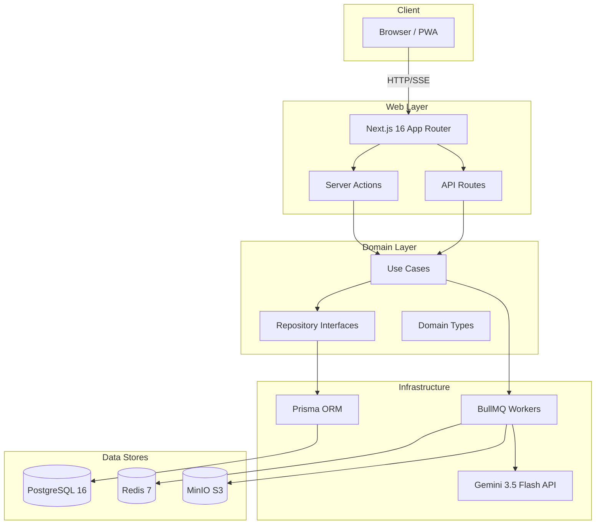

<div align="center">
  
  <h1>Ibn Al-Azhar Docs | مستندات ابن الأزهر</h1>
  <p><strong>في بيت كل طالب أزهري</strong></p>
  <p><em>An Arabic-first, RTL-first, AI-powered document processing platform tailored for Azhar students and Arabic literature.</em></p>

  <p align="center">
    
    
    
    
    
  </p>
</div>

---

## 🌟 Overview

**Ibn Al-Azhar Docs** is a state-of-the-art document processing workspace designed to digitize and manage complex Arabic and English texts with unmatched accuracy. 

Powered by a cutting-edge pipeline, it leverages **Google's Gemini 3.5 Flash** as its primary OCR engine to flawlessly extract Arabic text, preserve complex formatting, and intelligently handle diacritics (Tashkeel). The platform processes PDFs and images, cleans the output with custom Arabic text normalization, and generates beautifully structured formats: Markdown, Word (DOCX), plain text, JSON, and Searchable PDF.

Self-hosted, highly scalable, and privacy-focused—your documents remain securely on your infrastructure.

## ✨ Key Features

- 🧠 **AI-Powered Arabic OCR**: PDF/Image → Validation → Split → **Gemini 3.5 Flash OCR** → Arabic Text Cleanup → Markdown → Export.
- 🔤 **Advanced Text Normalization**: Alef unification, smart tashkeel handling, tatweel stripping, bidi control character removal, OCR artifact repair, and intelligent heading detection.
- 📁 **Document Management**: Nested folders (up to depth 5), tagging system, bulk operations, and secure soft delete/restore.
- 🔍 **Full-Text Arabic Search**: PostgreSQL `tsvector` with deep Arabic normalization and ranked results.
- 📤 **Versatile Exports**: Instantly convert to Markdown, TXT, JSON, DOCX (via Pandoc), or Searchable PDF.
- 🔗 **Secure Sharing**: Time-limited sharing with token regeneration, expiration, and role-based access.
- 🔐 **Enterprise Security**: NextAuth.js (Credentials + Google OAuth), bcrypt (cost 12), JWT sessions, CSRF protection, aggressive rate limiting, CSP, and HSTS.

## 🏗️ Architecture



**Infrastructure Stack**: PostgreSQL 16 (via PgBouncer) + Redis 7 + MinIO (S3-compatible) + BullMQ + Caddy (TLS).

## 🚀 Getting Started

### Prerequisites
- Docker & Docker Compose
- Node.js 22.x
- pnpm 10.x
- Google Gemini API Key

### Development Setup

```bash
# 1. Install dependencies
pnpm install

# 2. Configure environment (Add your Gemini API Key here)
cp .env.example .env

# 3. Start local infrastructure (Postgres :5433 + Redis :6379 + MinIO :9000)
./ibn.sh dev-infra

# 4. Setup database schema and seed
pnpm db:generate && pnpm db:migrate && pnpm db:seed

# 5. Launch the web application
pnpm --filter @ibn-al-azhar-docs/web dev
```

### Production Deployment

**Self-hosted** (Docker Compose):
```bash
cp .env.example .env  # Ensure GEMINI_API_KEY and other secrets are set
docker compose up -d --build
```

**Free hosting** (HuggingFace Spaces):
See the [HF Deployment Guide](docs/deployment/HF_DEPLOYMENT_GUIDE.md) for deploying on a zero-cost stack using Neon.tech + Upstash + HuggingFace Spaces.

## 🧪 Testing & Reliability

The project boasts a robust testing suite ensuring enterprise-grade stability:

| Command                 | Suite            | Tests | Coverage Focus                       |
| ----------------------- | ---------------- | ----- | ------------------------------------ |
| `pnpm test`             | Unit             | 800+  | Core logic, Utilities, Frontend      |
| `pnpm test:integration` | Integration      | 200+  | Database, Caching, End-to-End API    |
| `pnpm test:security`    | Security         | 213+  | OWASP top 10, Auth, Permissions      |
| `pnpm test:e2e`         | End-to-End       | 50+   | Playwright browser automation        |

## 📚 Documentation

Detailed documentation can be found in the [`docs/`](docs/) directory:

- 🏛️ **Architecture**: [`ARCHITECTURE_CURRENT.md`](docs/ARCHITECTURE_CURRENT.md)
- 🔒 **Security**: [`SECURITY_AUDIT_LOG.md`](docs/SECURITY_AUDIT_LOG.md)
- 🚀 **Deployment**: [`HF_DEPLOYMENT_GUIDE.md`](docs/deployment/HF_DEPLOYMENT_GUIDE.md)
- 📖 **API Reference**: [`openapi.yaml`](docs/openapi.yaml)
- 💻 **Coding Standards**: [`CODE_STYLE_GUIDE.md`](docs/reference/CODE_STYLE_GUIDE.md)

## 🎨 Brand Aesthetics

| Element        | Hex Value            |
| -------------- | -------------------- |
| Primary Green  | `#16A34A`            |
| Heritage Gold  | `#CA8A04`            |
| Dark Text Gray | `#1F2937`            |
| Primary Font   | Cairo / Inter        |
| Tagline        | في بيت كل طالب أزهري |

## 🤝 Contributing
We welcome contributions! Please review our [Contributing Guidelines](CONTRIBUTING.md) and [Code Style Guide](docs/reference/CODE_STYLE_GUIDE.md) before submitting pull requests.

## 📄 License
This project is licensed under the [MIT License](LICENSE).
