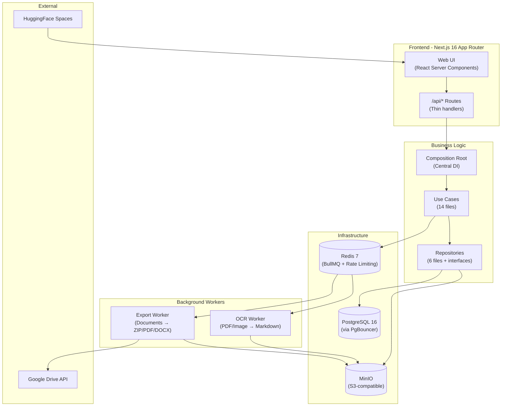
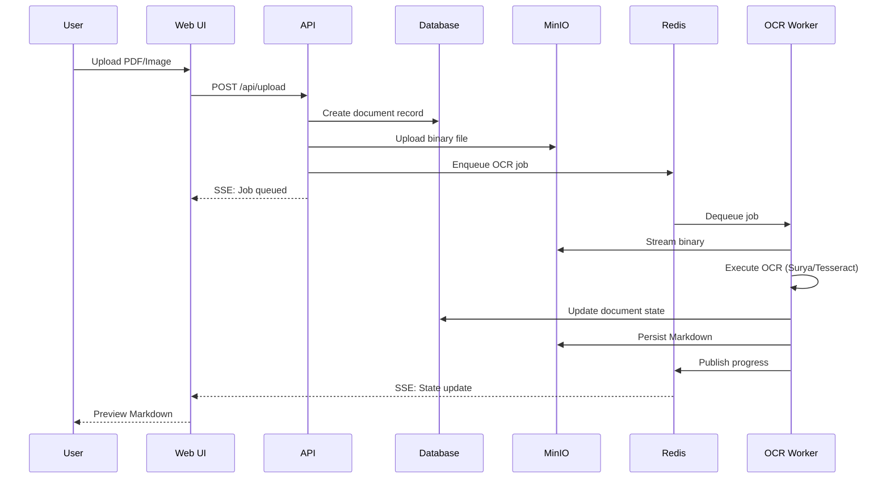
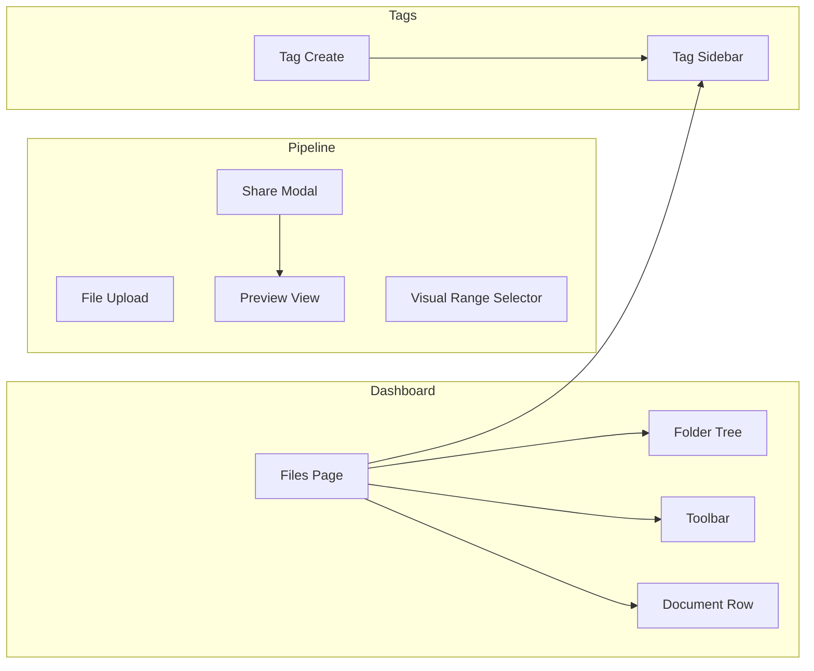
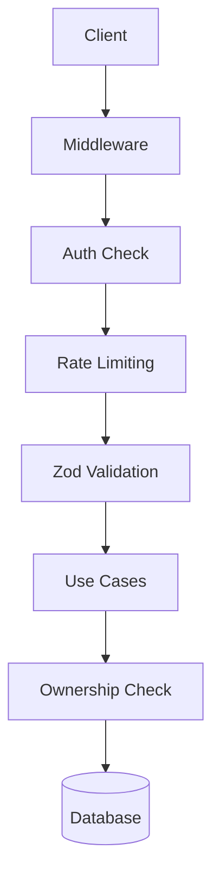

# Architecture Diagram

```mermaid
graph TB
    subgraph "Frontend - Next.js 16 App Router"
        UI["Web UI<br/>(React Server Components)"]
        API["/api/* Routes<br/>(Thin handlers)"]
    end

    subgraph "Business Logic"
        CR["Composition Root<br/>(Central DI)"]
        UC["Use Cases<br/>(14 files)"]
        REPO["Repositories<br/>(6 files + interfaces)"]
    end

    subgraph "Infrastructure"
        DB[("PostgreSQL 16<br/>(via PgBouncer)")]
        REDIS[("Redis 7<br/>(BullMQ + Rate Limiting)")]
        MINIO[("MinIO<br/>(S3-compatible)")]
    end

    subgraph "Background Workers"
        OCR["OCR Worker<br/>(PDF/Image → Markdown)"]
        EXPORT["Export Worker<br/>(Documents → ZIP/PDF/DOCX)"]
    end

    subgraph "External"
        GOOGLE["Google Drive API"]
        HF["HuggingFace Spaces"]
    end

    UI --> API
    API --> CR
    CR --> UC
    UC --> REPO
    REPO --> DB
    REPO --> MINIO
    UC --> REDIS
    REDIS --> OCR
    REDIS --> EXPORT
    OCR --> MINIO
    EXPORT --> MINIO
    EXPORT --> GOOGLE
    HF --> UI
```

## Data Flow

```mermaid
sequenceDiagram
    participant U as User
    participant W as Web UI
    participant A as API
    participant D as Database
    participant S as MinIO
    participant R as Redis
    participant O as OCR Worker

    U->>W: Upload PDF/Image
    W->>A: POST /api/upload
    A->>D: Create document record
    A->>S: Upload binary file
    A->>R: Enqueue OCR job
    A-->>W: SSE: Job queued
    R->>O: Dequeue job
    O->>S: Stream binary
    O->>O: Execute OCR (Surya/Tesseract)
    O->>D: Update document state
    O->>S: Persist Markdown
    O->>R: Publish progress
    R-->>W: SSE: State update
    W-->>U: Preview Markdown
```

## Component Hierarchy

```mermaid
graph LR
    subgraph "Dashboard"
        FS[Files Page]
        FT[Folder Tree]
        TB[Toolbar]
        DR[Document Row]
    end

    subgraph "Pipeline"
        FU[File Upload]
        VRS[Visual Range Selector]
        SM[Share Modal]
        PV[Preview View]
    end

    subgraph "Tags"
        TS[Tag Sidebar]
        TC[Tag Create]
    end

    FS --> FT
    FS --> TB
    FS --> DR
    FS --> TS
    SM --> PV
    TC --> TS
```

## Security Layers

```mermaid
graph TB
    CLIENT[Client] --> MW[Middleware]
    MW --> AUTH[Auth Check]
    AUTH --> RATE[Rate Limiting]
    RATE --> ZOD[Zod Validation]
    ZOD --> BIZ[Use Cases]
    BIZ --> OWN[Ownership Check]
    OWN --> DB[(Database)]
```
