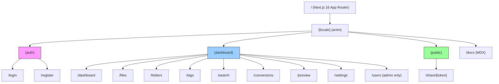
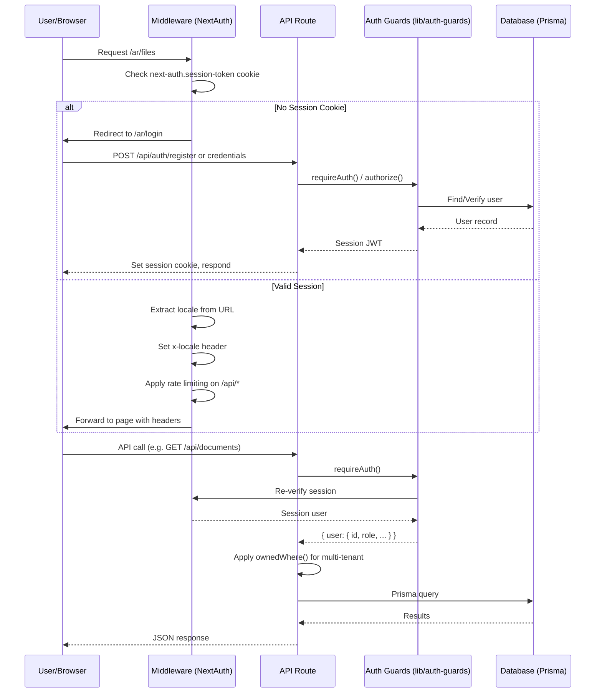
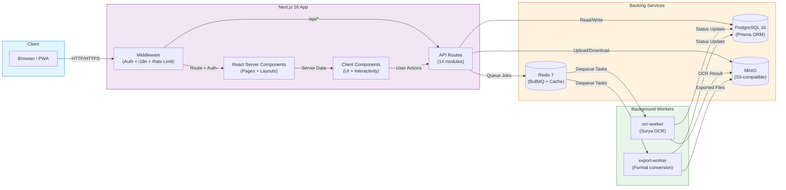
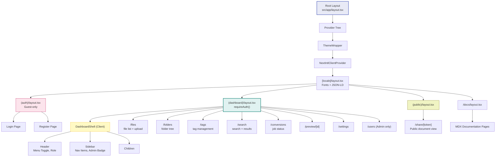
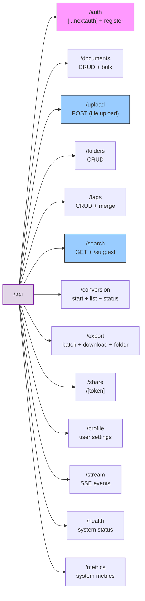
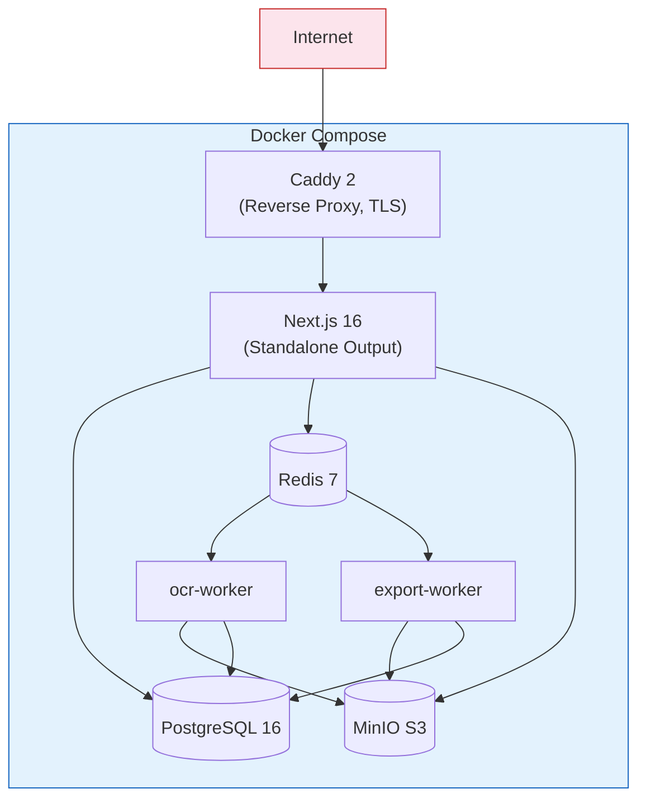

# Ibn Al-Azhar Docs — Architecture Diagram

> Updated: 2025-06-14

## Page Structure (App Router)

## Auth Flow

## Data Flow — Document Upload & Processing

## Component Hierarchy

## API Route Map

## Infrastructure & Deployment

## Key Design Decisions

| القرار               | الخيار            | السبب                                 |
| -------------------- | ----------------- | ------------------------------------- |
| Authentication       | NextAuth v5 (JWT) | بدون جلسات — مناسب لـ API-first       |
| Database ORM         | Prisma 6          | Type-safety + migrations              |
| Queue                | BullMQ + Redis    | معالجة خلفية موثوقة                   |
| OCR                  | Surya (محلي)      | خصوصية تامة — لا APIs خارجية          |
| Storage              | MinIO (S3)        | متوافق مع S3 — يسهل التبديل للـ Cloud |
| Internationalization | next-intl         | RTL-first + SSR                       |
| Monorepo             | pnpm workspaces   | بدون Turborepo — بساطة                |
